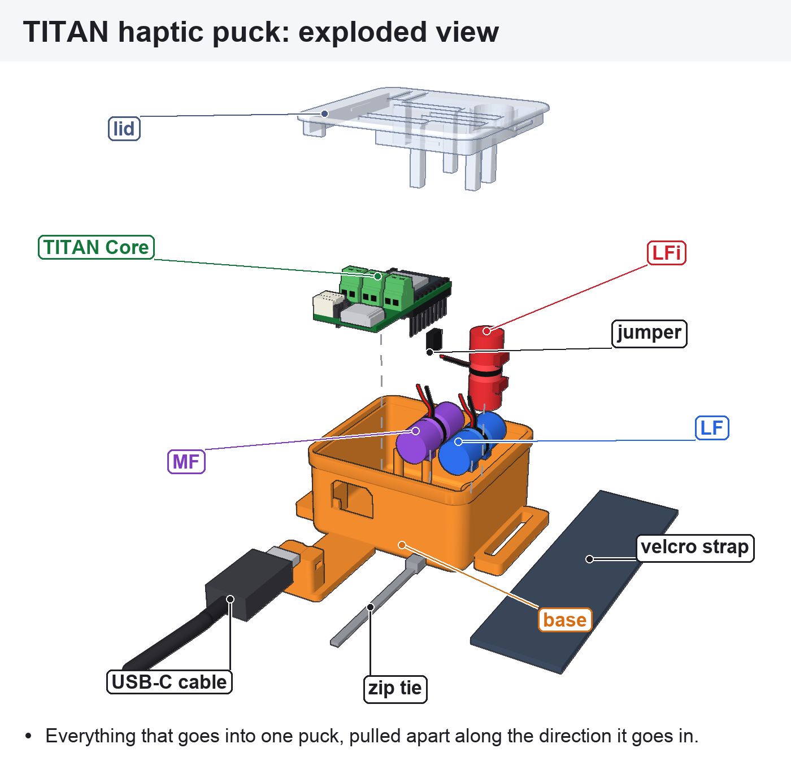
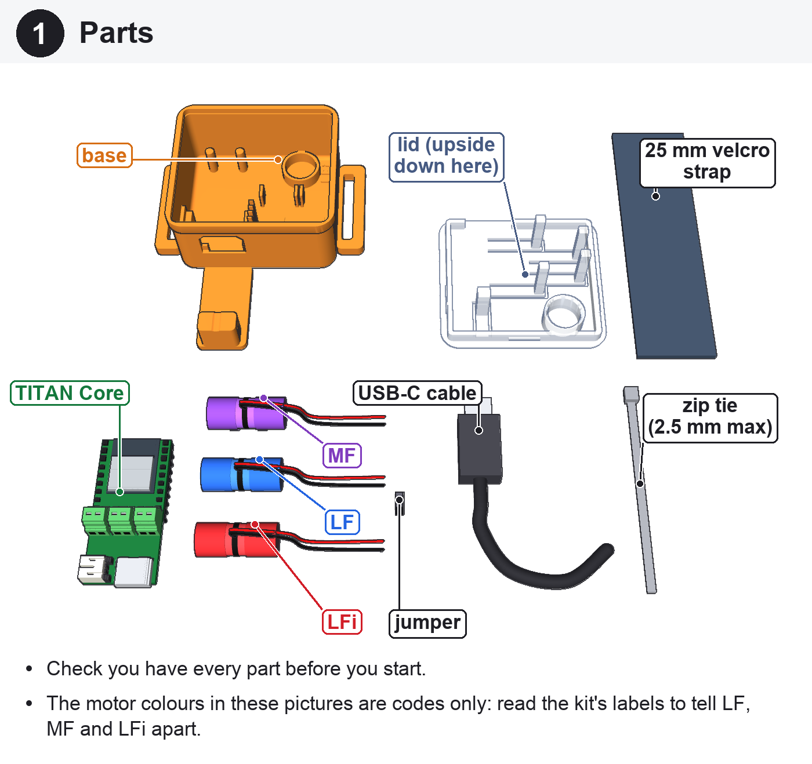
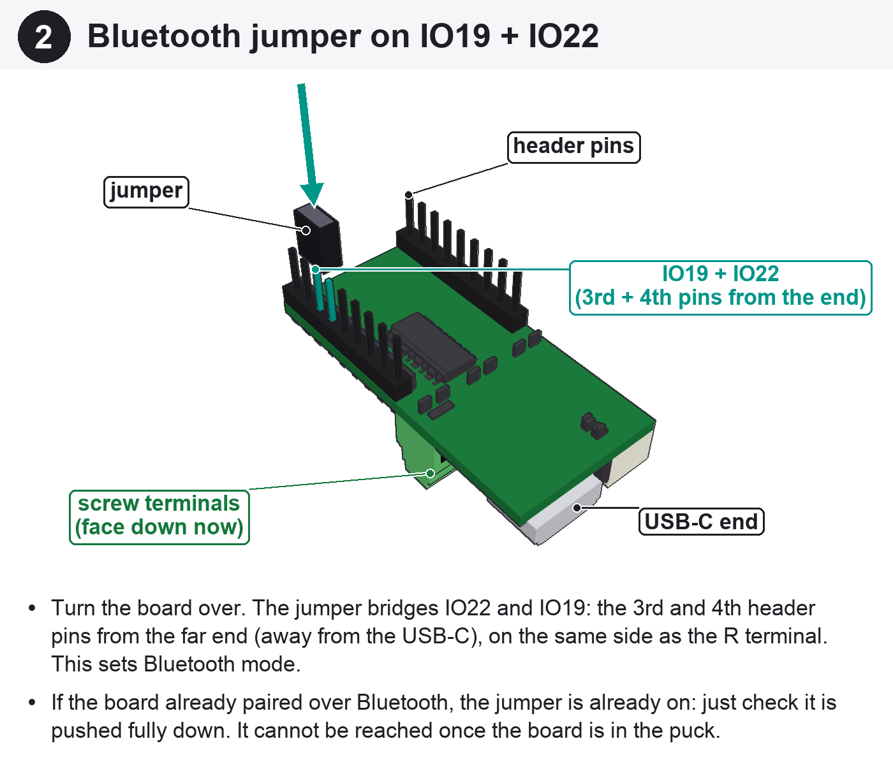
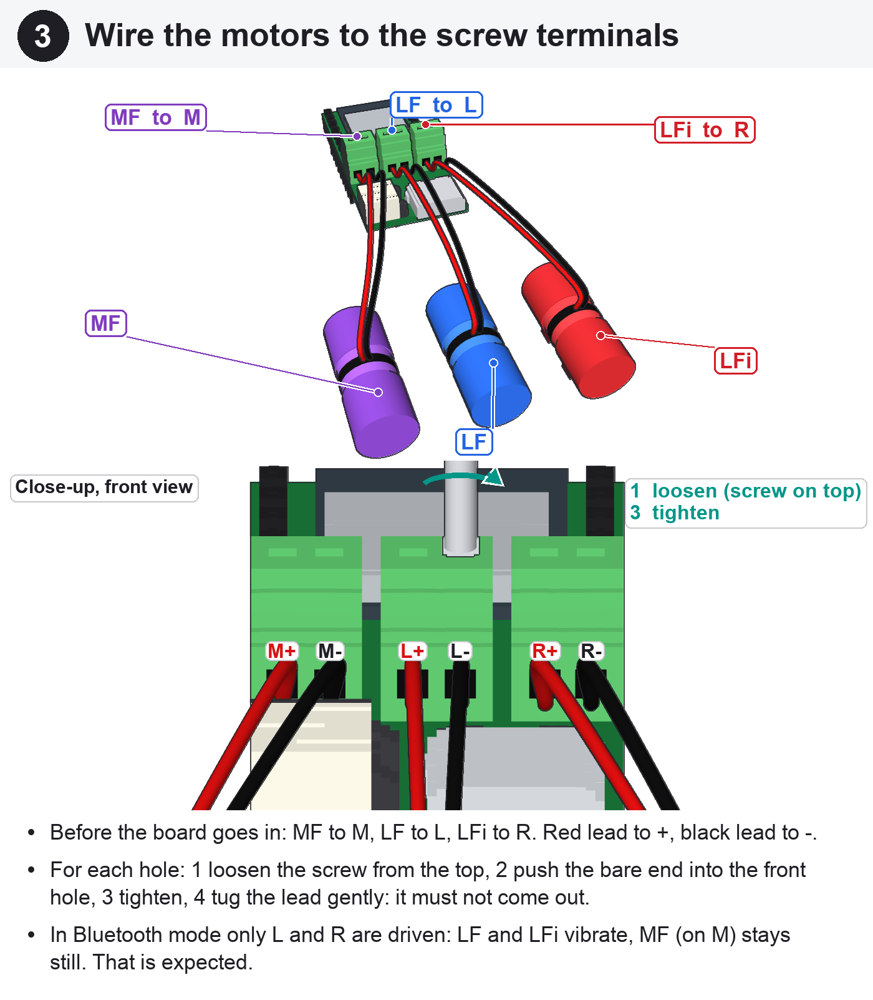
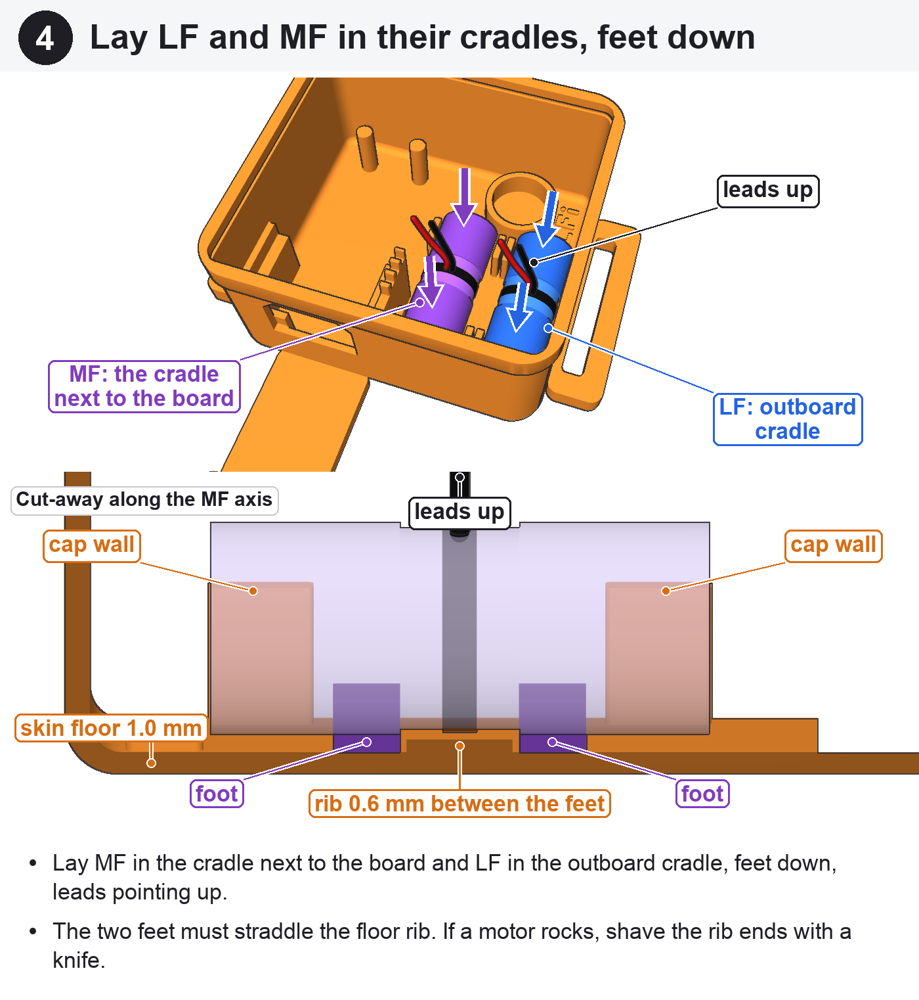
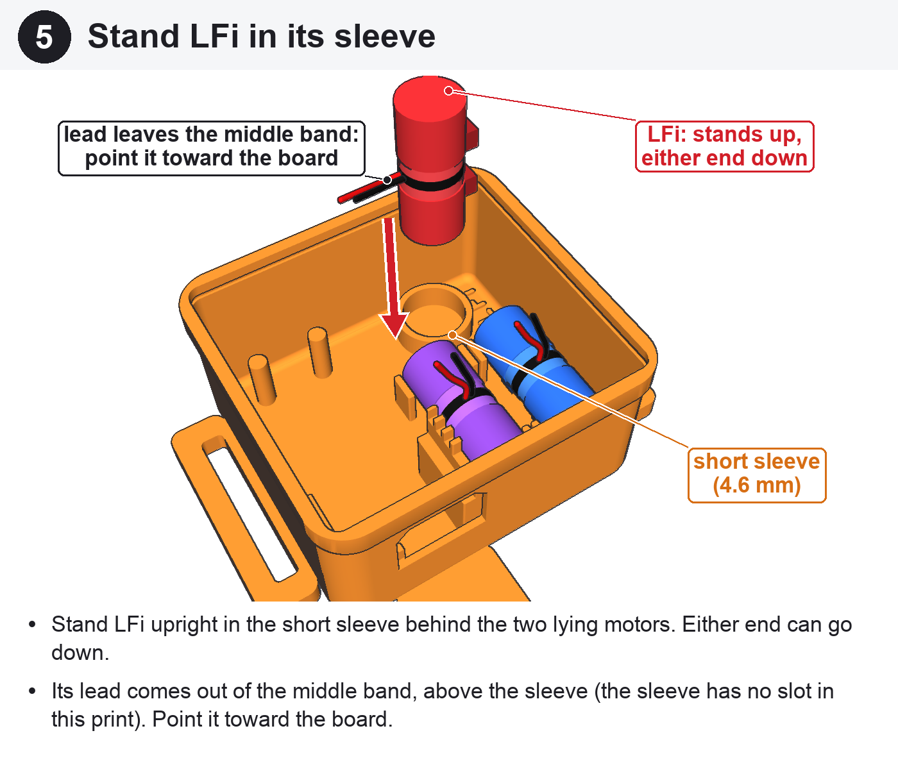
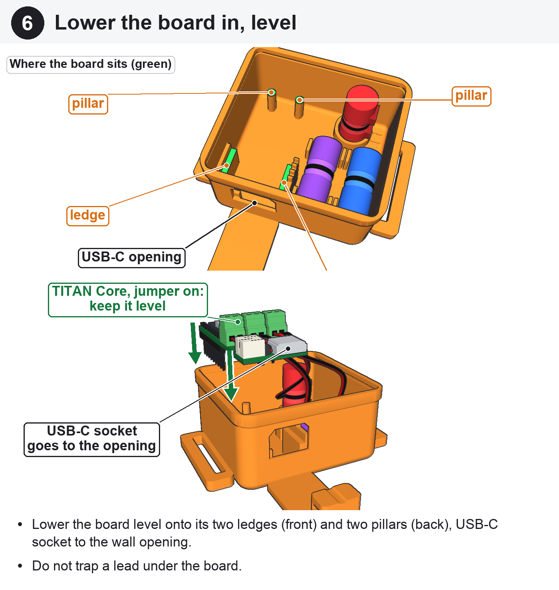
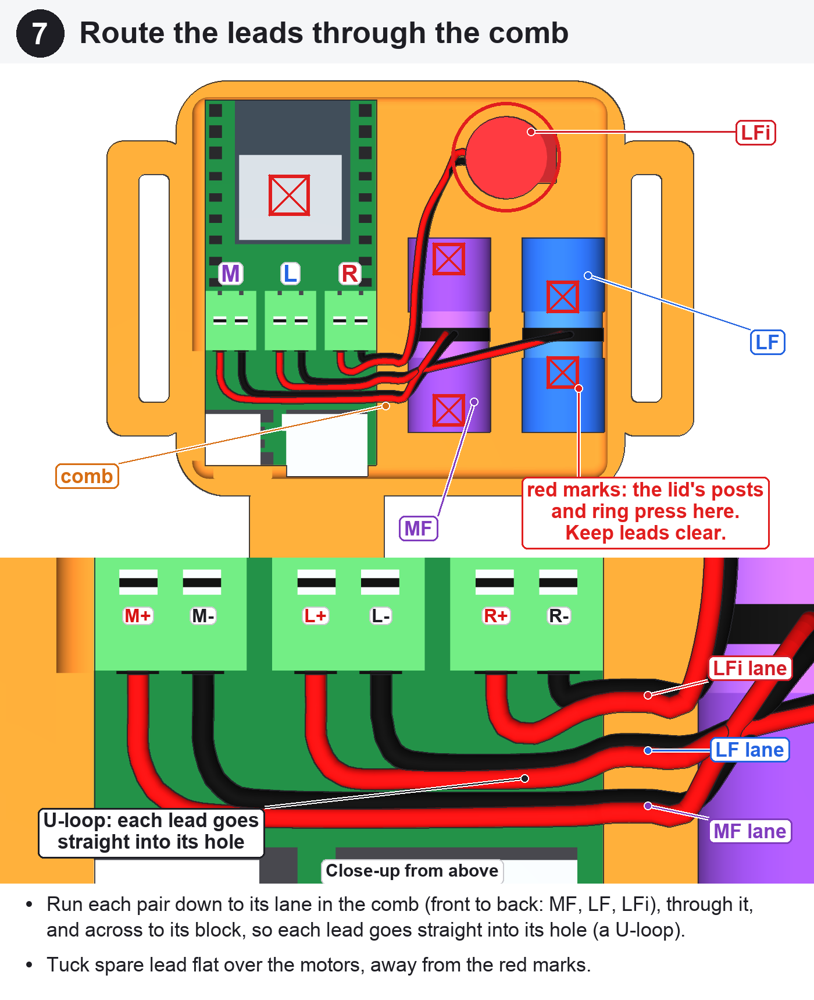
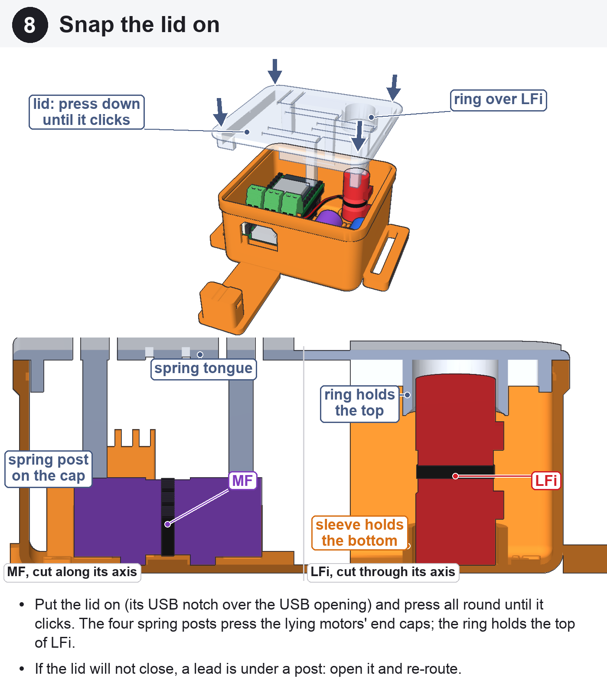
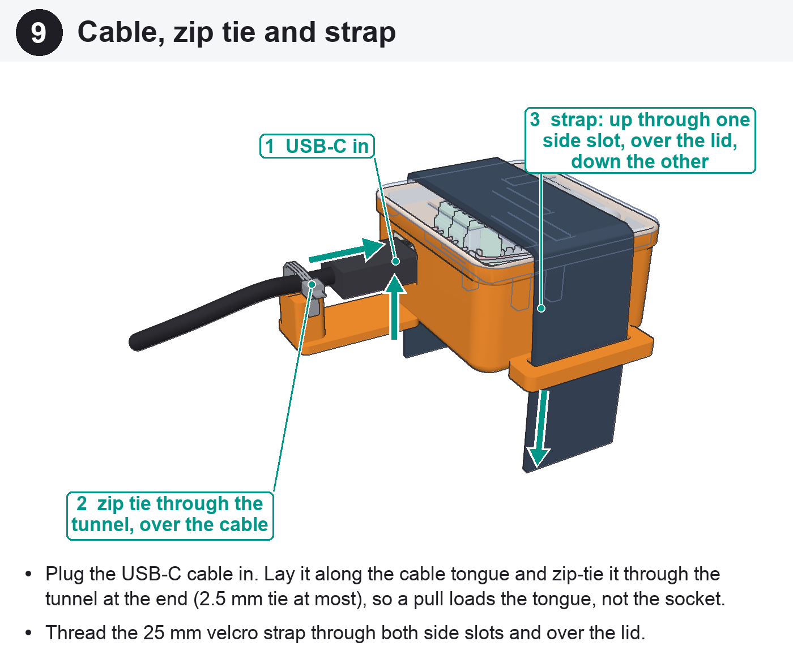

# TITAN haptic puck: assembly

For the draft printed on 2026-09-19 (commit 30e2ae1, `puck_plate.3mf`). Every picture is rendered from `model.py`; the
TITAN Core is drawn from `titan_core_keepout.json`. `sheet.png` has all the steps on one page for a phone.

The motor colours in the pictures are codes only (LF blue, MF purple, LFi red). Read the kit's labels to tell the motors
apart.



## 1. Parts



Base, lid, TITAN Core, the three motors (LF, MF, LFi), a jumper, a USB-C cable, a zip tie (2.5 mm wide at most) and a
25 mm velcro strap.

## 2. Bluetooth jumper on IO19 + IO22



Turn the board over. The jumper bridges IO22 and IO19: the 3rd and 4th header pins from the far end (away from the
USB-C), on the same side as the R terminal (TITAN QuickStart Guide, page 10). If the board already paired over Bluetooth, the
jumper is already on, so just check it is pushed fully down. You cannot reach it once the board is in.

## 3. Wire the motors to the screw terminals



Do this before the board goes in. Connect MF to M, LF to L and LFi to R, with the red lead to + and the black lead to -.
For each lead, loosen the screw from the top, push the bare end into the front hole, tighten the screw and tug the lead.
In Bluetooth mode only L and R are driven, so LF and LFi vibrate and MF (on M) stays still. That is expected.

## 4. Lay LF and MF in their cradles, feet down



MF goes in the cradle next to the board and LF in the outboard cradle, feet down and leads up. The two feet go either
side of the floor rib. If a motor rocks, shave the ends of the rib with a knife.

## 5. Stand LFi in its sleeve



Stand LFi upright in the short sleeve. Either end can go down. Its lead comes out of the middle band, above the sleeve,
because the sleeve in this print has no slot. Point the lead toward the board.

## 6. Lower the board in, level



Lower the board level onto its two ledges at the front and its two pillars at the back, with the USB-C socket at the
wall opening. Keep the leads out from under the board.

## 7. Route the leads through the comb



Run each pair down to its lane in the comb (front to back: MF, LF, LFi), through the lane and across to its terminal
block. Each lead makes a U-loop and goes straight into its hole. Tuck spare lead flat over the motors, away from the
red marks, which show where the lid's posts and ring press.

## 8. Snap the lid on



Put the lid on with its USB notch over the USB opening, then press all round until it clicks. The four spring posts
press on the end caps of the lying motors, and the ring holds the top of LFi. If the lid will not close, a lead is
under a post, so open the lid and route that lead again.

## 9. Cable, zip tie and strap



Plug in the USB-C cable, lay it along the cable tongue and put the zip tie through the tunnel at the end of the tongue,
so that a pull loads the tongue rather than the socket. Thread the velcro strap up through one side slot, over the lid
and down through the other.

---

To regenerate the images (from `hardware/titan-puck`):

```
uv run --quiet --python 3.12 --with-requirements requirements.txt --with pillow python assembly/build.py
```
