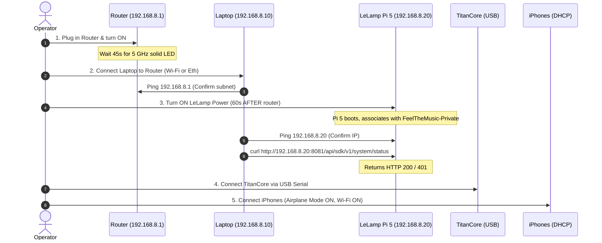

# Demo-Day Operations Runbook: Feel the Music

**Status**: Operational Runbook for Hack the North 2026.  
**Audience**: Booth Conductors, Hardware Monitors, DevOps Operators, and Participant Facilitators.  
**Companion Document**: [`ops/network.md`](network.md) (Network Architecture & Configuration).

---

## 1. Roles & Responsibilities

Every live demonstration must have clearly assigned human responsibilities:

| Role | Responsibility | Position |
|---|---|---|
| **Booth Conductor** | Controls the laptop, starts audio tracks, monitors sync stream (UDP 47300), and calibrates room latency budget $L$. | Seated at Conductor Laptop |
| **Robot Safety Monitor** | Has hand on the physical emergency power switch at all times during robot motion; monitors thermal temps and arm clearances. | Standing beside the LeLamp station |
| **Participant Facilitator** | Welcomes Deaf and hard-of-hearing attendees, explains sensory modalities, provides iPhones / TitanCore actuators, and gathers feedback. | Standing beside the participant chair |

---

## 2. Hardware Checklist & Station Inventory

Verify all physical equipment is present before powering any circuit:

### 2.1 Networking & Host Station
- [ ] 1x Dedicated 5 GHz Wi-Fi Router (GL.iNet / TP-Link) + 12V power supply.
- [ ] 1x Conductor Laptop (macOS / Linux / Windows) with Python 3.11 environment.
- [ ] 1x Master Power Strip with illuminated ON/OFF rocker switch (acts as Emergency Stop).
- [ ] 1x Cat6 Ethernet cable (for wired laptop-to-router connection, optional but recommended).

### 2.2 Robot Station
- [ ] 1x LeLamp Robot (borrowed unit with Raspberry Pi 5 8GB, Debian 13).
- [ ] 1x LeLamp 12V 5A DC barrel power adapter.
- [ ] 1x Vendor runtime token loaded into `/etc/environment` or lamp user env (never committed to git).
- [ ] Minimum **50 cm (20 in) radius clearance zone** around the lamp base, completely clear of wires, laptops, water bottles, and obstacles.

### 2.3 Haptic Stations
- [ ] 2-3x Demo iPhones with native app *Feel the Music: Sync & Haptics* (App Store ID `6812197651`) installed, charged $\ge 80\%$.
- [ ] 1x TitanCore kit:
  - 1x ESP32 controller board.
  - 1x PAM8403 Class-D stereo amplifier (driving Left and Right continuous bass voice coils).
  - 1x DRV8212 H-bridge driver (driving Middle transient tick actuator).
  - 1x High-speed USB-C to USB-A/C serial data cable (rated $\ge 115200$ baud).
  - 1x Dedicated 5V 2.5A USB power bank (isolating actuator back-EMF from laptop USB bus).

---

## 3. The Golden Power Sequence (T-30 Minutes)

> [!CAUTION]
> **CRITICAL RULE**: Never power on the LeLamp robot before the Wi-Fi router. Never reboot the router while the LeLamp is on. Violating this sequence triggers the **Silent Demo Killer** (LeLamp reverts to fallback setup AP and locks out the LAN).

Follow this sequence in exact chronological order:



### Step-by-Step Procedure:
1. **Power on Router**: Plug into the master power strip. Wait ~45 seconds until the 5 GHz Wi-Fi status LED is solid green.
2. **Connect Conductor Laptop**: Connect laptop to `FeelTheMusic-Private`. Verify static or DHCP lease `192.168.8.10`.
   - Ping gateway: `ping -c 2 192.168.8.1`
3. **Power on LeLamp**: Toggle the LeLamp power switch.
   - Wait 60–90 seconds for Debian 13 and the vendor runtime to boot.
   - Listen for the startup chime and observe status LED transition from pulsing white to steady calm.
   - Ping LeLamp: `ping -c 2 192.168.8.20`
   - Test SDK Gateway:
     ```bash
     curl -s -m 2 http://192.168.8.20:8081/api/sdk/v1/system/status
     ```
4. **Connect TitanCore Haptic Kit**:
   - Plug the external 5V 2.5A power bank into the PAM8403 power rail.
   - Connect the USB data cable to the Conductor laptop.
   - Identify the serial port (`/dev/ttyUSB0` on Linux, `/dev/cu.usbserial-*` on macOS, `COM3`/`COM4` on Windows).
5. **Connect Demo iPhones**:
   - Swipe down Control Center: Tap **Airplane Mode = ON**.
   - Tap **Wi-Fi = ON** and connect to `FeelTheMusic-Private`.
   - In **Settings > Cellular**, verify **Wi-Fi Assist = OFF**.
   - Launch *Feel the Music* native app. Confirm the status bar indicates: `Connected to Conductor (UDP 47300)`.

---

## 4. Latency Calibration & Presentation Timing

All sensory output fires on the conductor's shared clock via presentation timestamps:
$$\text{Schedule Time} = \text{pts} + L - \text{trim}$$

- **Room Latency Budget ($L$)**: **300 ms** (0.300 seconds). Never attempt to reduce $L$; the budget allows all wireless nodes to buffer and schedule simultaneously.
- **Client Latency Trims**:
  - **iPhone Taptic Engine**: $\text{trim}_{\text{phone}} = \mathbf{25\text{ ms}}$. (Core Haptics AHAP schedule pre-roll).
  - **TitanCore Actuators**: $\text{trim}_{\text{titan}} = \mathbf{5\text{ ms}}$. (Direct serial baud transit + DRV8212 gate switch).
  - **Lamp Glow (WCAG Limiter)**: $\text{trim}_{\text{glow}} = \mathbf{30\text{ ms}}$. (HTTP loopback call + LED driver ramp; note that full color fade is $\approx 600\text{ ms}$).
  - **Lamp Choreographed Gestures**: $\text{trim}_{\text{gesture}} = \mathbf{2000\text{ ms}}$. (Vendor minimum-jerk trajectory planner lead time).

### Late Event Policy:
If a packet arrives where $\text{pts} + L - \text{trim} < \text{now} - 80\text{ ms}$, the client **must drop** the event immediately and increment the `dropped_late_events` telemetry counter. **Never fire an event late.** A late beat destroys musical immersion.

---

## 5. Live Demonstration Protocol

### 5.1 Welcoming Participants
1. Greet the participant warmly. Ask if they prefer written communication, visual cues, or spoken explanation.
2. Explain the experience:
   > *"Feel the Music translates audio into touch, light, and motion simultaneously. You will hold an actuator that plays the rhythm into your hands, while the robot lamp in front of you watches and performs the music with you."*
3. Hand the participant either:
   - The native demo iPhone (with Core Haptics active), or
   - The TitanCore tactile puck (transmitting low-frequency bass on L/R and crisp transient ticks on M).
4. Invite the participant to sit in the chair facing the lamp head at a distance of **1.0 to 1.5 meters**.

### 5.2 Starting the Performance
1. **Safety Check**: Ensure the Robot Safety Monitor is standing in position with line of sight to the lamp.
2. **Start Conductor**: Launch the performance playback script on the Conductor Laptop:
   ```bash
   uv run --python 3.11 conductor/hub.py --track demo_track.wav --budget 300
   ```
3. **Verify Feedback**:
   - Observe listener smiling or reacting as the haptic kick fires.
   - Confirm LeLamp smooth yaw/tilt tracks the listener's head/hand.
   - Confirm lamp light glows with the bass envelope without rapid flashing ($\le 3$ pulses/sec, strictly compliant with WCAG 2.2 SC 2.3.1).

### 5.3 Ending the Session
1. Send gracefully closing animation to the lamp (`nod` or `happy`).
2. Thank the participant and ask for their sensory impression:
   - Did the haptics feel locked to the light?
   - Was the lamp motion engaging or distracting?
   - Was the bass vibration clear on the palms?

---

## 6. Emergency & Incident Recovery Playbooks

```
+-----------------------------------------------------------------------------------------+
|                               INCIDENT RESOLUTION MATRIX                                |
+-----------------------+----------------------------------+------------------------------+
| Symptom               | Root Cause                       | Immediate Action             |
+-----------------------+----------------------------------+------------------------------+
| Lamp arm runaway or   | Planner desync, mechanical       | SLAP MASTER POWER SWITCH.    |
| physical collision    | obstruction, or raw joint bug    | Never try to catch arm.      |
|                       |                                  |                              |
| HTTP 409 Conflict /   | Overlapping motion commands or   | Wait 2.5s for settle; check  |
| "Motion in progress"  | cooldown timer violation (<3.0s) | lamp/performance.py log.     |
|                       |                                  |                              |
| Silent Killer: Lamp   | Router rebooted or lamp started  | 1. Power OFF lamp.           |
| offline, setup AP up  | before router broadcast          | 2. Verify router 5 GHz SSID. |
|                       |                                  | 3. Power ON lamp; wait 60s.  |
|                       |                                  |                              |
| iPhone stops vibrating| Wi-Fi Assist routed to cellular  | Airplane Mode ON, Wi-Fi ON,  |
| or drops connection   | or venue network auto-joined     | turn off Wi-Fi Assist.       |
|                       |                                  |                              |
| TitanCore stops or    | Actuator inrush brownout or USB  | Reconnect USB, verify 5V     |
| serial hangs          | serial buffer overflow           | battery pack charge.         |
|                       |                                  |                              |
| Late events dropping  | Clock drift or RF congestion on  | Pin router to 20MHz channel; |
| (>10% drop rate)      | 2.4 GHz channel                  | re-estimate offset theta.    |
+-----------------------+----------------------------------+------------------------------+
```

### Playbook A: Physical Emergency Stop (Arm Runaway)
1. **Slap the illuminated master rocker switch** on the power strip immediately.
2. All 12V power to the LeLamp servos is severed instantly. The arm will rest on its compliant stops.
3. Inspect for mechanical pinching, obstruction, or strained cables.
4. Do NOT attempt to catch or wrestle the motorized joints while powered.

### Playbook B: The "Silent Killer" Recovery (Lamp Disconnected)
1. If `ping 192.168.8.20` fails and an SSID named `LeLamp-Setup-XXXX` appears:
2. **Turn OFF the LeLamp power switch.**
3. Verify on your laptop that `FeelTheMusic-Private` is active and reachable (`ping 192.168.8.1`).
4. **Turn ON the LeLamp power switch.** Wait 60 seconds.
5. Re-run ping and curl verification script.

### Playbook C: HTTP 409 Conflict / Motion Lock
1. The vendor SDK planner rejects new moves with HTTP 409 if a previous move is executing or settling.
2. Send an explicit halt command via curl:
   ```bash
   curl -X POST http://192.168.8.20:8081/api/sdk/v1/system/stop
   ```
3. Allow the vendor runtime 3 seconds to clear its trajectory queue before issuing the next gesture.

---

## 7. Teardown & Post-Demo Checklist

1. **Park Robot**: Issue home pose command via vendor SDK. Allow servos to settle.
2. **Thermal Cool-Down**: Allow the Raspberry Pi 5 fan to idle for 2 minutes before cutting power if the SoC was running hot ($> 65^\circ\text{C}$).
3. **Power Down**:
   - Turn OFF LeLamp power switch.
   - Disconnect TitanCore battery pack.
   - Power OFF Conductor Laptop and Wi-Fi Router.
4. **Hardware Storage**: Pack the LeLamp robot into its padded transit flight case, protecting the 3D-printed head shade and gimbal joints.
